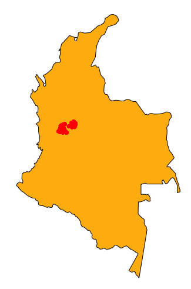

### ColombiaBirdMorpho package :bird:

# A morphological, reproductive, and molt phenology database for 379 bird species from the Colombian Tropical Andes

## Contributors
Leydy J. Cardona-Salazar, Yeny A. Benavides-Ossa, Ángela M. Vargas-Daza, Juan F. Betancurt-Grisales, Mauricio Bohada-Murillo, Estefani T. Martínez-Sánchez, Marelid Cardona-Romero, Ana Busi, William D. Tobón-Escobar, Mateo Ortíz-Giraldo, Daniela Gómez Castillo, Johnathan Alvarez-Londoño, Dimas A. Molina-Marin, Juan C. Rodas-Rua, Laura D. Grisales-Muñoz, Vanessa Velásquez-Trujillo, Luisa F. Salazar-Ramírez, Diana M. Pineda-Gómez, Alejandro Hoyos-Jaramillo, Rafael R. Santisteban-Arenas, Juan G. Salazar-Ramírez, Gloria Patricia Orozco-Montoya, Santiago A. Ramos-Valencia, Germán Gómez-Londoño, Fabiola Ospina-Bautista, Jaime V. Estévez-Varón, Paula A. Ossa-López, Fredy A. Rivera-Páez, Jorge E. Pérez Cárdenas, [Francisco E. Fontúrbel](https://github.com/fonturbel/) & Gabriel J. Castaño-Villa

## Overview
The Colombian Tropical Andes is amongst the highest bird diversity places on Earth. However, the information on bird morphology, reproductive phenology, and molting is particularly scarce in this region. Also, this region is heavily impacted by forestation and it is vulnerable to climate change. Hence, it is necessary to have baseline information on this regard to support future research on functional diversity, climate change effects, conservation, evolution, and phenology. To fill this gap, the Research Group on Tropical Ecosystems has compiled information on bird distribution, morphology, molt, and reproductive phenology at 52 localities of the Department of Caldas, covering an elevation range between 148 and 3845 m. Therefore, this compilation comprises a wide range of habitats, including native forests, forestry plantations, croplands, and paramo zones. Our database presents information for 3398 specimens belonging to 379 bird species (representing 23 orders, 53 families, and 258 genera). From those records, 2843 are based on information collected in the field between 2008 and 2019, and the remaining 555 records correspond to specimens deposited in the Natural History Museum of the Caldas University, collected between 1969 and 2014. We measured nine morphological traits from all specimens: total culmen, gape, bill width, bill depth, tarsus, wing length, tail length, total length, and weight. We also have reproductive condition for 257 species and molt information available for 378 species. The information contained in this dataset represents ~20% of the Colombian avifauna and ~11% of the bird species richness in South America.

## Study area

Map of the localities included in the database of birds of the Tropical Andes.  (a) Colombia location in South America; (b) department of Caldas location in Colombia; (c) sampling sites location at department of Caldas, and (d) elevation of the sampling localities (distance represents extreme localities).

Location of the sampling records in Colombia.

Detail of the sampling locations.

**IMPORTANT:** Georeferrencing on this dataset presents two levels of spatial resolution. On the one hand, data derived from fieldwork has very precise locations, with GPS georeferencing with an error threshold below 5 m. On the other hand, we have museum records that have variable spatial resolution. More recent museum specimens have GPS coordinates associated (with a reasonable error level below 10 m), but older records have fuzzy locations, mainly approximated to the nearest populated place or other reference sites (e.g., reserves or rivers).

## Temporal coverage
This dataset presents information collected between 1969 and 2019, corresponding to museum specimens and individuals collected in the field.

## Taxonomic coverage
This dataset presents information on 379 species, belonging to 53 families. These numbers correspond to ~20% of the Colombian avifauna and ~11% of the bird species richness in South America.

## References

**Main paper**

Cardona-Salazar, L.J. et al. 2020. A morphological, reproductive, and molt phenology database for 379 bird species from the Colombian Tropical Andes (data paper). Under review in Ecology. [doi: 10.1002/ecy.3016](https://doi.org/10.1002/ecy.3016)

**Mirror data repository**

Cardona-Salazar, L.J. et al. 2019. A morphological, reproductive, and molt phenology database for 379 bird species from the Colombian Tropical Andes. _figshare_ digital repository, [doi: 10.6084/m9.figshare.10052408](https://doi.org/10.6084/m9.figshare.10052408)

